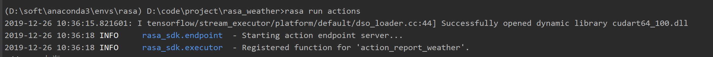
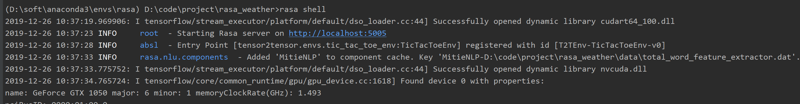
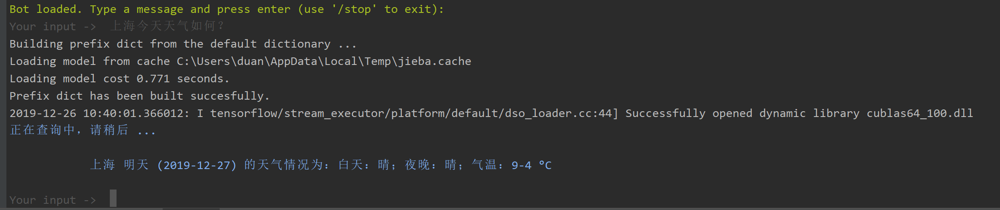

# rasa_weather安装部署

https://github.com/pingyuan2016/rasa_weather/

## 本文说明

注：本文是学习使用rasa框架构建任务型聊天机器人，数据和逻辑来自Xiaoquan Kong @ <https://github.com/howl-anderson>，用最新版rasa翻新，感谢大佬，原文详情请看https://github.com/howl-anderson/WeatherBot

rasa官网：https://rasa.com/
rasa帮助文档：https://rasa.com/docs/rasa/ （能解决百分九十的问题）

## 环境

python = 3.6

rasa = 1.5.3

## rasa环境安装

注：最好在python虚拟环境中安装，例如virtualenv

安装 rasa

`pip install rasa-x --extra-index-url https://pypi.rasa.com/simple`

安装mitie

`pip install git+https://github.com/mit-nlp/MITIE.git`

`pip install rasa[mitie]`

安装jieba

`pip install jieba`

## 数据准备

data目录中，nlu和stories都已存在

total_word_feature_extractor.dat需要下载：

从 [https://github.com/howl-anderson/MITIE_Chinese_Wikipedia_corpus](https://github.com/howl-anderson/MITIE_Chinese_Wikipedia_corpus/releases) 下载，解压缩后放置到 `data/total_word_feature_extractor.dat`

天气预测调用的[心知天气](https://www.seniverse.com/)的接口，需要申请api key（私钥）放入到api.py中

## 训练

注：默认自带一个模型，不想训练，环境装好可以直接运行（如果运行报错，需要重新训练）

注：默认会训练rasa_nlu和rasa_core

`rasa train`

结果在models里面

## 两种方法运行：

### 第一种：shell运行（windows或者linux都可以）

action执行，启动解析用户说话内容:

`rasa run actions `

执行rasa，启动模型：

`rasa shell`

### 第二种：带聊天界面

action执行，启动解析用户说话内容:

`rasa run actions `

rasa执行（启动rasa接口，指定端口，cors是解决跨域名的问题）：

`rasa run -m models --enable-api --log-file out.log -p 5500 --cors "*"`

运行web服务，

`python http-server.py`

默认访问<http://127.0.0.1:5000/index>

## 在线演示

[天气预报聊天机器人](http://www.nlpport.com/freedom/weather/)

[个人网站](http://www.nlpport.com)
